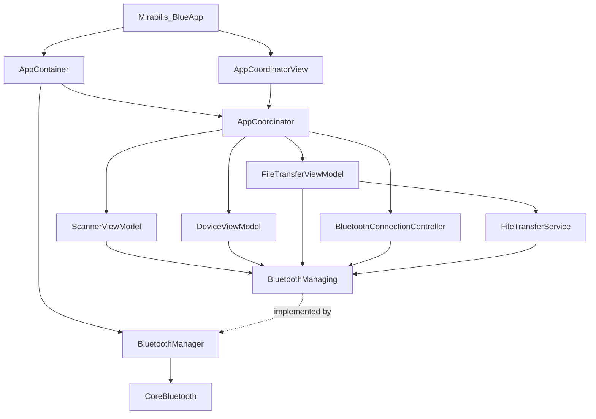
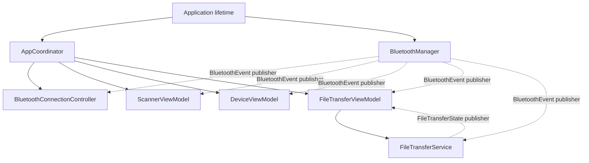
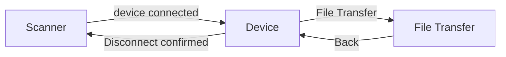
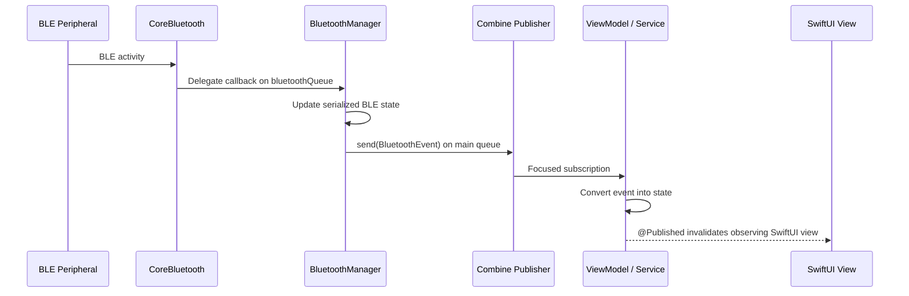

# Mirabilis Blue — Application Architecture

> **Purpose:** High-level architectural guide for developers joining or maintaining the Mirabilis Blue iOS application.
>
> This document describes the application structure, ownership model, dependency injection, concurrency boundaries, navigation, and event flow. BLE-specific details are documented in [`BLUETOOTH_ARCHITECTURE.md`](./BLUETOOTH_ARCHITECTURE.md), while the file-transfer protocol is documented in [`FILE_TRANSFER.md`](./FILE_TRANSFER.md).

---

## 1. Architectural goals

The project is intentionally structured around a small number of clear boundaries rather than a large framework or service-locator architecture.

The main goals are:

- keep SwiftUI independent from CoreBluetooth implementation details;
- use explicit initializer-based dependency injection;
- maintain one app-scoped BLE transport;
- keep navigation out of feature ViewModels;
- serialize CoreBluetooth work on one dedicated queue;
- deliver presentation-facing changes on the main actor;
- model BLE and file-transfer behavior with explicit state and events;
- prevent retain cycles through explicit ownership and cancellable Combine subscriptions;
- use Combine for long-lived BLE/service streams and `ObservableObject`/`@Published` for ViewModel-to-SwiftUI updates;
- expose publishers as `AnyPublisher` so subjects remain implementation details.

The application follows an MVVM + Coordinator style with a lightweight Clean Architecture separation between Presentation, Domain/Support types, and Infrastructure.

---

## 2. High-level component diagram



The important architectural rule is that **SwiftUI and feature ViewModels do not know about `CBCentralManager`, `CBPeripheral`, `CBService`, or `CBCharacteristic`**. CoreBluetooth types are confined to the BLE infrastructure layer.

---

## 3. Layer responsibilities

### Presentation

Presentation contains SwiftUI views, feature ViewModels, and the application coordinator.

Typical components:

- `ScannerView`
- `ScannerViewModel`
- `DeviceView`
- `DeviceViewModel`
- `FileTransferView`
- `FileTransferViewModel`
- `AppCoordinator`
- `AppCoordinatorView`
- `BluetoothConnectionController`

Responsibilities include presenting state, reacting to user input, determining whether an action is available, navigation, connection/reconnection UX, and converting domain or transport events into UI state.

Presentation code must not directly call CoreBluetooth.

### Domain / support types

These are lightweight value types and contracts shared across layers.

Typical components:

- `BluetoothDevice`
- `BluetoothState`
- `BluetoothEvent`
- `BluetoothError`
- `BluetoothManaging`
- `MirabilisUUID`
- `FileTransferState`
- `FileTransferError`
- `FileTransferChunk`
- `FileTransferProtocol`
- `SelectedFile`

These types provide the language used between Presentation and Infrastructure.

### Infrastructure

Infrastructure contains platform-specific transport behavior.

Primary component:

- `BluetoothManager`

Responsibilities include owning `CBCentralManager`, scanning, connection management, service and characteristic discovery, GATT reads and writes, notification subscriptions, translation of CoreBluetooth delegate callbacks into app-level `BluetoothEvent` values, and serialization of mutable BLE state.

`FileTransferService` sits above the transport and below the feature ViewModel. It is protocol/application logic rather than raw CoreBluetooth infrastructure.

---

## 4. Dependency injection

The project uses **initializer injection**.

There is no global `BluetoothManager.shared`, no service locator, and no DI framework.

At application construction time, a single `BluetoothManager` is created and passed through the object graph as `BluetoothManaging`.

Conceptually:

```swift
let bluetoothManager = BluetoothManager()

let coordinator = AppCoordinator(
    bluetoothManager: bluetoothManager
)
```

The coordinator then creates feature ViewModels using the same injected dependency.

This gives the app one BLE transport while allowing consumers to depend on a protocol rather than the concrete implementation.

---

## 5. Ownership model



### Strong ownership

- the application/container owns the app-scoped BLE transport;
- the coordinator owns navigation state and long-lived application presentation components;
- feature Views own their feature ViewModels for the lifetime of the screen;
- `FileTransferViewModel` owns `FileTransferService`.

### Reactive subscriptions

Consumers own their Combine subscriptions in `Set<AnyCancellable>` collections. Subscription closures capture presentation/service objects weakly, so the event stream does not extend their lifetime. When a consumer is deallocated, its `AnyCancellable` values are deallocated and the subscriptions cancel automatically.

`BluetoothManager` owns a private `PassthroughSubject<BluetoothEvent, Never>` and exposes only `AnyPublisher<BluetoothEvent, Never>`. `FileTransferService` owns a private `CurrentValueSubject<FileTransferState, Never>` and likewise exposes only an erased publisher.

The former Bluetooth weak-observer API has been removed. The Combine publisher is now the sole event-delivery mechanism from the transport to application consumers.

---

## 6. Navigation

Navigation is coordinator-driven.

Current route model:

```swift
enum Route: Hashable {
    case device(BluetoothDevice)
    case fileTransfer(BluetoothDevice)
}
```

The primary flow is:



A ViewModel can know that the user requested a BLE action, but it should not know how the application's `NavigationStack` is structured.

For the intentional-disconnect flow, the coordinator performs both application-level actions:

1. request BLE disconnection;
2. clear the navigation path and return to Scanner.

This keeps navigation policy out of the BLE and feature layers.

---

## 7. Concurrency model

The project has a simple concurrency rule:

> **BLE IN → `bluetoothQueue`**
>
> **UI OUT → `MainActor`**

### BLE queue

`BluetoothManager` owns a dedicated serial queue:

```text
com.mirabilis.bluetooth
```

The queue serializes `CBCentralManager` delegate callbacks, connection state, discovered peripheral storage, discovered characteristic storage, reads, writes, notification changes, and scan state.

### Main actor

Presentation models such as `AppCoordinator`, `BluetoothConnectionController`, and feature ViewModels use `@MainActor`.

`BluetoothManager` translates CoreBluetooth callbacks into `BluetoothEvent` values and publishes them on the main queue. This preserves the project rule that `@MainActor` presentation consumers receive UI-facing events on the main execution context.

---

## 7.1 Combine presentation state

The presentation migration is complete. Presentation objects conform to
`ObservableObject`, and mutable state consumed by SwiftUI is marked
`@Published`. Combine is also used selectively for derived presentation
state when multiple changing inputs have a meaningful relationship.

Ownership is explicit at the view boundary:

- use `@ObservedObject` for objects whose lifetime is managed elsewhere;
- use `@StateObject` for a ViewModel instance owned by the view.

This matters for factory-created navigation destinations. `DeviceView` and
`FileTransferView` use `@StateObject` so their ViewModels survive body
reevaluation while the destination remains in the navigation stack.
`ScannerView` uses `@ObservedObject` because `AppCoordinator` owns its
`ScannerViewModel`.

Nested `ObservableObject` state is not implicitly forwarded. Where a
ViewModel needs another observable object's changing state, it subscribes
explicitly. `BluetoothConnectionController` derives and publishes
`isConnected` from its connection state, and `FileTransferViewModel`
subscribes to `BluetoothConnectionController.$isConnected`.

The resulting presentation flow is:

```text
Combine service/event publishers
        ↓
ObservableObject ViewModel / controller
        ↓
@Published UI state
        ↓
@StateObject / @ObservedObject
        ↓
SwiftUI
```

Commands and navigation callbacks remain explicit imperative operations.


### 7.2 Selective reactive derivation

The project intentionally does **not** turn every computed property or user
action into a publisher.

The rule is:

> Use Combine for meaningful relationships between changing state. Keep
> trivial projections, formatting, and commands simple.

For file transfer, connection state and transfer state form a reusable
capability graph:

```text
BluetoothConnectionController.$isConnected
                    ↓
          FileTransferViewModel
                    ↓
          isTransferAvailable
           ├── canChooseFile
           ├── canDownload
           ├── canUpload
           └── canReadStatistics

$isConnected + $transferState
                    ↓
                 canCancel
```

Transfer presentation is derived once from the same underlying inputs:

```text
$transferState + $isConnected
                    ↓
      FileTransferPresentationState
           ├── statusText
           ├── uploadProgress
           ├── uploadProgressText
           ├── indeterminateProgressText
           └── isError
```

`canChooseFile` and `canDownload` remain computed aliases of
`isTransferAvailable`; they are not separate published state.

`DeviceViewModel` follows the same principle. Readiness and discovered
characteristics derive `availableCharacteristics`, which then feeds write,
read, and notification availability. Cheap presentation projections such as
status text remain computed.

### 7.3 Swift 6 isolation boundary

The project target uses modern Swift concurrency rules, while CoreBluetooth
work is intentionally serialized on `bluetoothQueue`.

Pure BLE/domain value types used on that queue must therefore remain usable
outside the main actor. Types such as `MirabilisUUID` and `BluetoothState`
are explicitly `nonisolated`.

The boundary is:

```text
CoreBluetooth callbacks
        ↓
bluetoothQueue
        ↓
nonisolated BLE/domain value types
        ↓
BluetoothManager events
        ↓
main queue / MainActor
        ↓
ObservableObject presentation layer
        ↓
SwiftUI
```

This keeps actor isolation strict where it matters without accidentally
forcing transport-layer value semantics onto `MainActor`.

## 8. Event flow

The application uses Combine as the event boundary between the CoreBluetooth transport and its consumers. CoreBluetooth delegates remain private to `BluetoothManager`; consumers receive application-level `BluetoothEvent` values instead.

```swift
protocol BluetoothEventProviding: AnyObject {
    var events: AnyPublisher<BluetoothEvent, Never> { get }
}
```

`BluetoothManager` owns the subject privately:

```swift
private let eventSubject =
    PassthroughSubject<BluetoothEvent, Never>()

var events: AnyPublisher<BluetoothEvent, Never> {
    eventSubject.eraseToAnyPublisher()
}
```

`PassthroughSubject` is intentional because `BluetoothEvent` represents transient occurrences; a newly-created subscriber should not receive an old discovery, write-completion, or disconnect event.



Consumers create focused pipelines with `compactMap` for only the event families they need. `ScannerViewModel`, `BluetoothConnectionController`, `DeviceViewModel`, `FileTransferService`, and `FileTransferViewModel` all use this path. Commands remain imperative methods on `BluetoothManaging`; Combine is used for asynchronous streams, not as a replacement for every operation.

`FileTransferService` separately publishes durable protocol state through `AnyPublisher<FileTransferState, Never>` backed by `CurrentValueSubject`, allowing `FileTransferViewModel` to receive the current transfer state immediately when it subscribes.

---

## 9. Connection UX as application-level state

`BluetoothConnectionController` is an app-level presentation controller for connection/reconnection behavior.

It exists because reconnect UX must be available regardless of which feature screen is active.

It tracks concepts such as the last connected device, connection state, intentional disconnects, reconnect alert presentation, and a dedicated reconnection-in-progress state.

### Initial connection vs reconnection

The app explicitly distinguishes:

- **initial connection** — initiated by the scanner;
- **reconnection** — initiated after an unexpected disconnect.

The global `Reconnecting...` overlay belongs only to the second case.

### Intentional vs unexpected disconnect

An intentional disconnect is marked before `cancelPeripheralConnection` is called. This lets the presentation layer suppress the reconnect alert when the user deliberately disconnects and returns to Scanner.

---

## 10. Error-handling strategy

Errors stay close to the layer that owns them.

### `BluetoothError`

Represents transport and GATT failures such as Bluetooth unavailable, device not found, connection failure, unexpected disconnection, no active connection, missing characteristic, unsupported operation, and GATT failures.

### `FileTransferError`

Represents protocol-level failures such as empty or oversized files, malformed packets, unexpected sequence numbers, NACK, timeout, disconnect during transfer, transfer already in progress, and wrapped `BluetoothError`.

A file-transfer error may wrap a BLE transport error. The BLE layer does not know about file-transfer semantics.

---

## 11. Defense in depth

For a BLE-backed feature such as file transfer:

```text
SwiftUI
    ↓
button disabled when operation is unavailable
    ↓
ViewModel
    ↓
guards current connection / state
    ↓
BluetoothManager
    ↓
guards connection + characteristic availability
    ↓
CoreBluetooth
```

The UI guard improves UX. The ViewModel guard protects application logic. The BLE guard protects the transport boundary.

---

## 12. Adding a new BLE-backed feature

A new feature should normally follow this sequence:

1. add or expose the characteristic in `MirabilisUUID`;
2. ensure metadata describes its readable/writable/notifiable behavior;
3. keep the CoreBluetooth operation inside `BluetoothManager`;
4. expose any higher-level domain protocol outside the transport when needed;
5. create a feature ViewModel that depends on `BluetoothManaging` or a narrower capability;
6. subscribe to `BluetoothManaging.events` and filter the `BluetoothEvent` values needed by the feature;
7. add a SwiftUI view;
8. add navigation through `AppCoordinator` when a new route is needed.

If the feature introduces a protocol on top of GATT, follow the same pattern as file transfer: create a separate service instead of adding protocol parsing to `BluetoothManager`.

---

## 13. Design rules

- CoreBluetooth types stay in the infrastructure layer.
- No BLE singleton.
- One clear owner for shared services.
- Prefer value types for events, state, identifiers, and protocol data.
- ViewModels do not manipulate the navigation stack.
- Navigation logic belongs to the coordinator.
- Protocol-level features do not leak into `BluetoothManager`.
- BLE mutable state stays on the dedicated serial queue.
- Presentation state stays on the main actor.
- Combine sinks capture owners weakly and subscriptions are retained in `Set<AnyCancellable>`.
- Use explicit state rather than multiple loosely-related booleans.
- Favor readable Swift over clever abstractions.
- Add protocols at meaningful boundaries, not around every class.

---

## 14. Related documentation

- [`BLUETOOTH_ARCHITECTURE.md`](./BLUETOOTH_ARCHITECTURE.md) — CoreBluetooth transport, lifecycle, GATT, reconnection, and Combine event delivery.
- [`FILE_TRANSFER.md`](./FILE_TRANSFER.md) — BLE-MIRABILIS-BLUE upload/download protocol and state machines.
- Firmware Developer Guide v0.6.2 — peripheral behavior and protocol source of truth.
- GATT Reference v0.6.2 — characteristic-level firmware contract.
