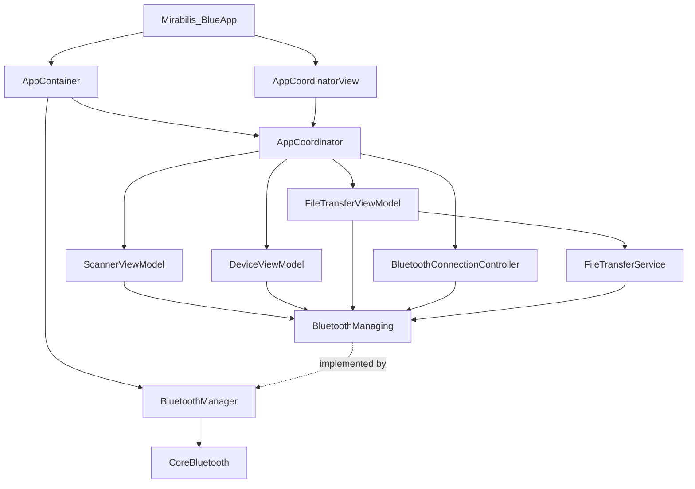
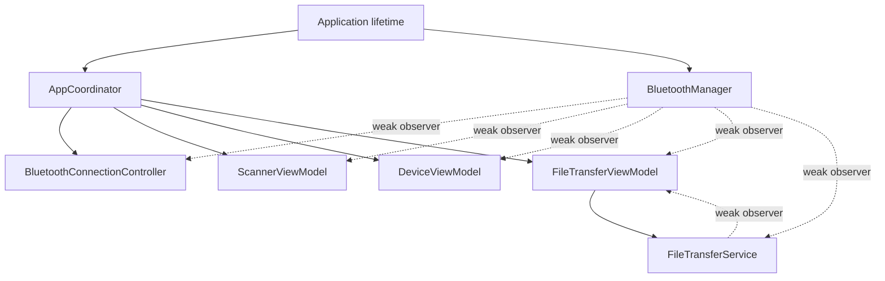
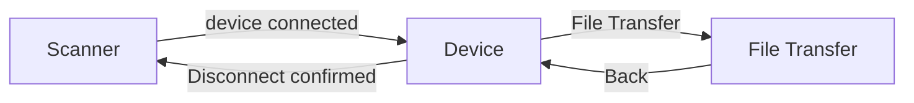
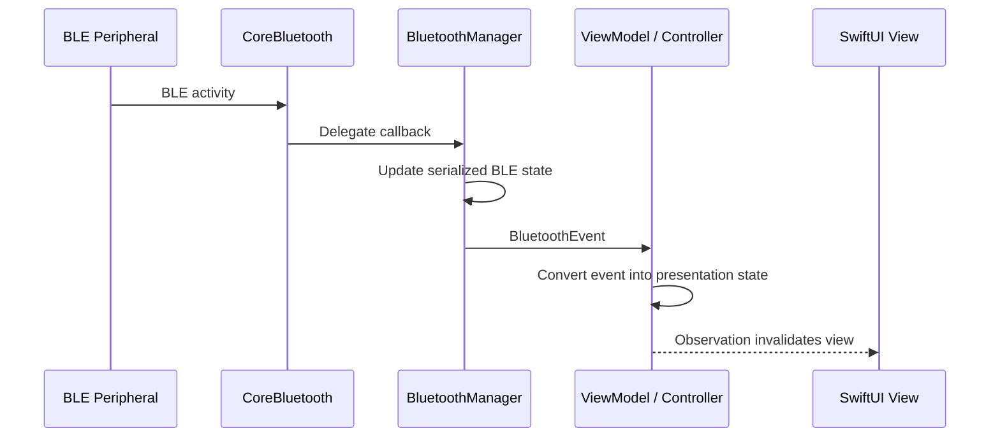

# Mirabilis Blue — Application Architecture

> **Purpose:** High-level architectural guide for developers joining or maintaining the Mirabilis Blue iOS application.
>
> This document describes the application structure, ownership model, dependency injection, concurrency boundaries, navigation, and event flow. BLE-specific details are documented in [`BLUETOOTH_ARCHITECTURE.md`](./BLUETOOTH_ARCHITECTURE.md), while the file-transfer protocol is documented in [`FILE_TRANSFER.md`](./FILE_TRANSFER.md).

---

## 1. Architectural goals

The project is intentionally structured around a small number of clear boundaries rather than a large framework or service-locator architecture.

The main goals are:

- keep SwiftUI independent from CoreBluetooth implementation details;
- use explicit initializer-based dependency injection;
- maintain one app-scoped BLE transport;
- keep navigation out of feature ViewModels;
- serialize CoreBluetooth work on one dedicated queue;
- deliver presentation-facing changes on the main actor;
- model BLE and file-transfer behavior with explicit state and events;
- prevent retain cycles through clear ownership and weak observer relationships;
- keep the BLE layer reusable and compatible with a future Combine bridge without requiring Combine today.

The application follows an MVVM + Coordinator style with a lightweight Clean Architecture separation between Presentation, Domain/Support types, and Infrastructure.

---

## 2. High-level component diagram



The important architectural rule is that **SwiftUI and feature ViewModels do not know about `CBCentralManager`, `CBPeripheral`, `CBService`, or `CBCharacteristic`**. CoreBluetooth types are confined to the BLE infrastructure layer.

---

## 3. Layer responsibilities

### Presentation

Presentation contains SwiftUI views, feature ViewModels, and the application coordinator.

Typical components:

- `ScannerView`
- `ScannerViewModel`
- `DeviceView`
- `DeviceViewModel`
- `FileTransferView`
- `FileTransferViewModel`
- `AppCoordinator`
- `AppCoordinatorView`
- `BluetoothConnectionController`

Responsibilities include presenting state, reacting to user input, determining whether an action is available, navigation, connection/reconnection UX, and converting domain or transport events into UI state.

Presentation code must not directly call CoreBluetooth.

### Domain / support types

These are lightweight value types and contracts shared across layers.

Typical components:

- `BluetoothDevice`
- `BluetoothState`
- `BluetoothEvent`
- `BluetoothError`
- `BluetoothManaging`
- `MirabilisUUID`
- `FileTransferState`
- `FileTransferError`
- `FileTransferChunk`
- `FileTransferProtocol`
- `SelectedFile`

These types provide the language used between Presentation and Infrastructure.

### Infrastructure

Infrastructure contains platform-specific transport behavior.

Primary component:

- `BluetoothManager`

Responsibilities include owning `CBCentralManager`, scanning, connection management, service and characteristic discovery, GATT reads and writes, notification subscriptions, translation of CoreBluetooth delegate callbacks into app-level `BluetoothEvent` values, and serialization of mutable BLE state.

`FileTransferService` sits above the transport and below the feature ViewModel. It is protocol/application logic rather than raw CoreBluetooth infrastructure.

---

## 4. Dependency injection

The project uses **initializer injection**.

There is no global `BluetoothManager.shared`, no service locator, and no DI framework.

At application construction time, a single `BluetoothManager` is created and passed through the object graph as `BluetoothManaging`.

Conceptually:

```swift
let bluetoothManager = BluetoothManager()

let coordinator = AppCoordinator(
    bluetoothManager: bluetoothManager
)
```

The coordinator then creates feature ViewModels using the same injected dependency.

This gives the app one BLE transport while allowing consumers to depend on a protocol rather than the concrete implementation.

---

## 5. Ownership model



### Strong ownership

- the application/container owns the app-scoped BLE transport;
- the coordinator owns navigation state and long-lived application presentation components;
- feature Views own their feature ViewModels for the lifetime of the screen;
- `FileTransferViewModel` owns `FileTransferService`.

### Weak observation

`BluetoothManager` stores observers weakly. `FileTransferService` also stores its observers weakly.

This is deliberate: event sources must not keep presentation objects alive.

When removing an observer asynchronously, the implementation must avoid retaining a deinitializing object. Capture an `ObjectIdentifier` rather than capturing the observer strongly inside an async closure.

---

## 6. Navigation

Navigation is coordinator-driven.

Current route model:

```swift
enum Route: Hashable {
    case device(BluetoothDevice)
    case fileTransfer(BluetoothDevice)
}
```

The primary flow is:



A ViewModel can know that the user requested a BLE action, but it should not know how the application's `NavigationStack` is structured.

For the intentional-disconnect flow, the coordinator performs both application-level actions:

1. request BLE disconnection;
2. clear the navigation path and return to Scanner.

This keeps navigation policy out of the BLE and feature layers.

---

## 7. Concurrency model

The project has a simple concurrency rule:

> **BLE IN → `bluetoothQueue`**
>
> **UI OUT → `MainActor`**

### BLE queue

`BluetoothManager` owns a dedicated serial queue:

```text
com.mirabilis.bluetooth
```

The queue serializes `CBCentralManager` delegate callbacks, connection state, discovered peripheral storage, discovered characteristic storage, reads, writes, notification changes, and scan state.

### Main actor

Presentation models such as `AppCoordinator`, `BluetoothConnectionController`, and feature ViewModels use `@MainActor`.

`BluetoothManager` translates CoreBluetooth callbacks into `BluetoothEvent` values and delivers observer notifications on the main queue.

---

## 8. Event flow

The application uses a small observer/event abstraction rather than exposing delegate callbacks outside the BLE layer.

Conceptually:

```swift
protocol BluetoothObserving: AnyObject {
    func bluetoothManager(
        _ manager: any BluetoothManaging,
        didReceive event: BluetoothEvent
    )
}
```



Typical events include state changes, discovery, connection, disconnection, GATT discovery, value updates, write completion, notification-state changes, and errors.

The event model is Combine-agnostic. A Combine publisher can be added later as an adapter without changing the CoreBluetooth boundary.

---

## 9. Connection UX as application-level state

`BluetoothConnectionController` is an app-level presentation controller for connection/reconnection behavior.

It exists because reconnect UX must be available regardless of which feature screen is active.

It tracks concepts such as the last connected device, connection state, intentional disconnects, reconnect alert presentation, and a dedicated reconnection-in-progress state.

### Initial connection vs reconnection

The app explicitly distinguishes:

- **initial connection** — initiated by the scanner;
- **reconnection** — initiated after an unexpected disconnect.

The global `Reconnecting...` overlay belongs only to the second case.

### Intentional vs unexpected disconnect

An intentional disconnect is marked before `cancelPeripheralConnection` is called. This lets the presentation layer suppress the reconnect alert when the user deliberately disconnects and returns to Scanner.

---

## 10. Error-handling strategy

Errors stay close to the layer that owns them.

### `BluetoothError`

Represents transport and GATT failures such as Bluetooth unavailable, device not found, connection failure, unexpected disconnection, no active connection, missing characteristic, unsupported operation, and GATT failures.

### `FileTransferError`

Represents protocol-level failures such as empty or oversized files, malformed packets, unexpected sequence numbers, NACK, timeout, disconnect during transfer, transfer already in progress, and wrapped `BluetoothError`.

A file-transfer error may wrap a BLE transport error. The BLE layer does not know about file-transfer semantics.

---

## 11. Defense in depth

For a BLE-backed feature such as file transfer:

```text
SwiftUI
    ↓
button disabled when operation is unavailable
    ↓
ViewModel
    ↓
guards current connection / state
    ↓
BluetoothManager
    ↓
guards connection + characteristic availability
    ↓
CoreBluetooth
```

The UI guard improves UX. The ViewModel guard protects application logic. The BLE guard protects the transport boundary.

---

## 12. Adding a new BLE-backed feature

A new feature should normally follow this sequence:

1. add or expose the characteristic in `MirabilisUUID`;
2. ensure metadata describes its readable/writable/notifiable behavior;
3. keep the CoreBluetooth operation inside `BluetoothManager`;
4. expose any higher-level domain protocol outside the transport when needed;
5. create a feature ViewModel that depends on `BluetoothManaging` or a narrower capability;
6. observe `BluetoothEvent` rather than CoreBluetooth delegates;
7. add a SwiftUI view;
8. add navigation through `AppCoordinator` when a new route is needed.

If the feature introduces a protocol on top of GATT, follow the same pattern as file transfer: create a separate service instead of adding protocol parsing to `BluetoothManager`.

---

## 13. Design rules

- CoreBluetooth types stay in the infrastructure layer.
- No BLE singleton.
- One clear owner for shared services.
- Prefer value types for events, state, identifiers, and protocol data.
- ViewModels do not manipulate the navigation stack.
- Navigation logic belongs to the coordinator.
- Protocol-level features do not leak into `BluetoothManager`.
- BLE mutable state stays on the dedicated serial queue.
- Presentation state stays on the main actor.
- Observers are weak.
- Use explicit state rather than multiple loosely-related booleans.
- Favor readable Swift over clever abstractions.
- Add protocols at meaningful boundaries, not around every class.

---

## 14. Related documentation

- [`BLUETOOTH_ARCHITECTURE.md`](./BLUETOOTH_ARCHITECTURE.md) — CoreBluetooth transport, lifecycle, GATT, reconnection, observers.
- [`FILE_TRANSFER.md`](./FILE_TRANSFER.md) — BLE-MIRABILIS-BLUE upload/download protocol and state machines.
- Firmware Developer Guide v0.6.2 — peripheral behavior and protocol source of truth.
- GATT Reference v0.6.2 — characteristic-level firmware contract.
