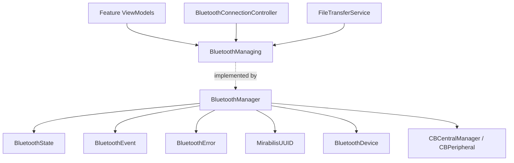
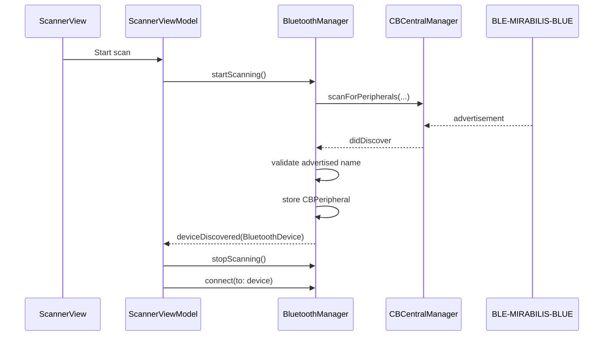
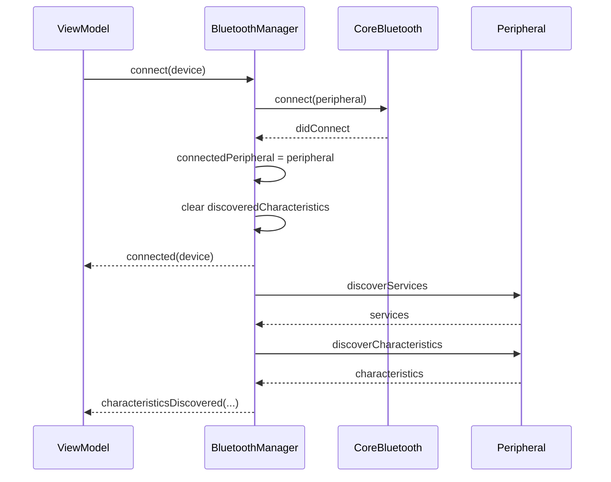
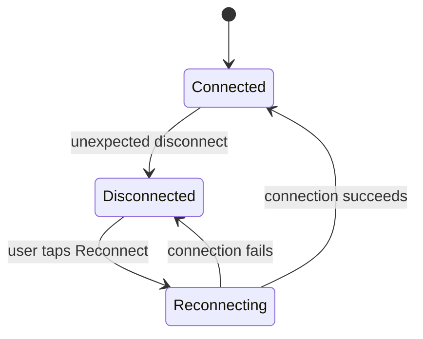

# Mirabilis Blue — Bluetooth Architecture

> **Purpose:** Detailed architecture of the Bluetooth Low Energy layer used by the Mirabilis Blue iOS application.
>
> The BLE layer isolates CoreBluetooth from SwiftUI and feature logic. It exposes app-level state, devices, events, errors, and characteristic identifiers instead of CoreBluetooth objects.

---

## 1. Scope

This document covers the BLE abstraction, `BluetoothManager`, `BluetoothManaging`, CoreBluetooth ownership, scan/connect/disconnect lifecycle, GATT discovery and operations, event delivery, reconnection behavior, threading, and error handling.

The file-transfer protocol built on top of the BLE transport is documented separately in [`FILE_TRANSFER.md`](./FILE_TRANSFER.md).

---

## 2. Main components



---

## 3. Application-facing boundary

The app does not depend directly on `BluetoothManager`.

Consumers depend on `BluetoothManaging`, composed from focused capabilities such as scanning, connecting, GATT access, and event observation.

Conceptually:

```swift
protocol BluetoothScanning: AnyObject {
    func startScanning()
    func stopScanning()
}

protocol BluetoothConnecting: AnyObject {
    func connect(to device: BluetoothDevice)
    func disconnect()
}

protocol BluetoothGATTAccessing: AnyObject {
    func read(_ characteristic: MirabilisUUID.Characteristic)

    func write(
        _ data: Data,
        to characteristic: MirabilisUUID.Characteristic
    )

    func setNotifications(
        _ enabled: Bool,
        for characteristic: MirabilisUUID.Characteristic
    )
}

protocol BluetoothEventProviding: AnyObject {
    func addObserver(_ observer: BluetoothObserving)
    func removeObserver(_ observer: BluetoothObserving)
}

protocol BluetoothManaging:
    BluetoothScanning,
    BluetoothConnecting,
    BluetoothGATTAccessing,
    BluetoothEventProviding {}
```

This boundary prevents CoreBluetooth types from escaping into Presentation.

---

## 4. `BluetoothManager`

`BluetoothManager` is the single app-scoped CoreBluetooth transport.

It owns:

- one lazy `CBCentralManager`;
- the dedicated serial BLE queue;
- current `BluetoothState`;
- discovered `CBPeripheral` objects;
- the connected `CBPeripheral`;
- discovered `CBCharacteristic` objects;
- weak observers.

Its implementation is split across focused extension files, for example:

```text
BluetoothManager.swift
BluetoothManager+Scan.swift
BluetoothManager+Connect.swift
BluetoothManager+GATT.swift
BluetoothManager+CBCentralManagerDelegate.swift
BluetoothManager+CBPeripheralDelegate.swift
```

The split is organizational only; the extensions collectively form one transport object.

---

## 5. Lazy CoreBluetooth initialization

`CBCentralManager` is created lazily.

Constructing the application dependency graph therefore does not immediately initialize Bluetooth hardware.

The first operation that needs the central manager triggers creation.

Because CoreBluetooth state may initially be `.unknown`, scanning uses a pending-scan mechanism so that a request made during initialization can begin once the central reaches `.poweredOn`.

---

## 6. Threading

All CoreBluetooth transport work is serialized on:

```text
bluetoothQueue
```

The `CBCentralManager` is initialized with that queue as its delegate queue.

Therefore:

```text
CBCentralManager delegate callbacks
        ↓
bluetoothQueue
        ↓
transport state mutation
        ↓
BluetoothEvent
        ↓
main queue
        ↓
@MainActor presentation object
```

### Do not

- mutate transport dictionaries from the main actor;
- call CoreBluetooth from arbitrary feature queues;
- expose `CBPeripheral` or `CBCharacteristic` to SwiftUI;
- update an `@Observable @MainActor` ViewModel directly from the BLE queue.

---

## 7. BLE state model

`BluetoothState` separates adapter availability from connection activity.

Conceptually:

```swift
struct BluetoothState: Equatable {
    var availability: Availability
    var activity: Activity
}
```

Availability includes states such as:

```text
unknown
resetting
unsupported
unauthorized
poweredOff
poweredOn
```

Activity includes:

```text
idle
scanning
connecting(deviceID)
connected(deviceID)
disconnecting(deviceID)
```

Separating those concerns avoids maintaining several unrelated booleans as independent sources of truth.

---

## 8. Device abstraction

A discovered peripheral is exposed outside the transport as a value type:

```swift
struct BluetoothDevice: Identifiable, Hashable {
    let id: UUID
    let name: String?
    let rssi: Int
}
```

The `UUID` corresponds to the CoreBluetooth peripheral identifier.

The app can navigate with and compare a `BluetoothDevice` without owning a `CBPeripheral`.

---

## 9. Scanning lifecycle

The current tutorial peripheral is identified by its expected advertised name.



`ScannerViewModel` owns scan UX such as the timeout. `BluetoothManager` owns only the transport operation.

---

## 10. Connection lifecycle

On successful connection, the transport:

1. stores the connected peripheral;
2. sets the peripheral delegate;
3. clears the old characteristic cache;
4. emits connection state/events;
5. discovers the known services.



The `.connected` event means the BLE link exists.

Features requiring characteristics should still wait until the required discovery has completed.

---

## 11. Typed GATT mapping

`MirabilisUUID` is the typed GATT namespace.

It maps app-level characteristic cases to `CBUUID` values and describes operation metadata such as:

- service membership;
- readability;
- notification capability;
- required write type.

This keeps raw UUID strings out of feature ViewModels.

| Characteristic | UUID / suffix | App usage |
|---|---|---|
| Serial Number | `2A25` | Device information |
| Hardware Revision | `2A27` | Device information |
| Firmware Revision | `2A26` | Device information |
| Basic Write | `...0002` | Write with response |
| Last Written Value | `...0003` | Readback |
| Observable Write | `...0004` | Update observable state |
| Observable Value | `...0005` | Read + Notify |
| Periodic Event Stream | `...0006` | Notify |
| Write Without Response | `...0007` | WNR example |
| Last WNR Value | `...0008` | Readback |
| Secure Write | `...0009` | Encrypted write |
| Secure State | `...000A` | Encrypted read + notify |
| File Transfer RX | `...000B` | WNR, central → peripheral |
| File Transfer TX | `...000C` | Notify, peripheral → central |
| Total Uploaded Bytes | `...000E` | Encrypted read |

The custom service UUID is:

```text
7E57A000-0000-4B1A-9C00-000000000001
```

---

## 12. GATT operations

The app exposes three generic operations:

```text
read(characteristic)
write(data, characteristic)
setNotifications(enabled, characteristic)
```

Each operation is enqueued on `bluetoothQueue`.

The manager validates:

1. whether the requested operation is supported;
2. whether a peripheral is connected;
3. whether the required `CBCharacteristic` has been discovered.

For a missing connection it emits:

```swift
.notConnected
```

For a missing characteristic it emits:

```swift
.characteristicNotFound(characteristic)
```

This distinction matters: a disconnected device is not the same problem as a GATT profile mismatch.

---

## 13. Stale characteristic prevention

On disconnect, the manager clears:

```text
connectedPeripheral
discoveredCharacteristics
```

This is important because `CBCharacteristic` instances belong to a specific peripheral/service discovery session.

After reconnection, services and characteristics are discovered again rather than continuing to use stale CoreBluetooth objects.

---

## 14. Event model

CoreBluetooth delegates are translated into `BluetoothEvent` values.

Typical events:

```text
stateChanged
deviceDiscovered
connected
disconnected
servicesDiscovered
characteristicsDiscovered
valueUpdated
writeCompleted
notificationStateChanged
error
```

Consumers implement:

```swift
BluetoothObserving
```

This keeps the transport independent of SwiftUI and Combine and allows multiple features to observe the same app-scoped manager.

---

## 15. Observer ownership

The BLE manager keeps observer references weakly.

Conceptually:

```swift
private final class WeakBluetoothObserver {
    weak var value: BluetoothObserving?
}
```

This prevents an event source from keeping feature ViewModels alive.

When observer removal is dispatched asynchronously, do not capture the observer strongly from `deinit`. Capture its `ObjectIdentifier` before scheduling the removal.

---

## 16. Unexpected disconnection

A disconnect can result from:

- range / signal loss;
- peripheral power loss;
- firmware reset;
- transport error;
- user-requested disconnect.

The BLE manager emits the disconnection event. The application-level connection controller interprets the event for presentation.

---

## 17. Intentional vs unexpected disconnect

Before a user-requested disconnect, the transport enters:

```text
.disconnecting(deviceID)
```

`BluetoothConnectionController` observes that transition and remembers that the next matching disconnect is intentional.

```text
User confirms Disconnect
    ↓
BluetoothManager → .disconnecting(deviceID)
    ↓
cancelPeripheralConnection
    ↓
.disconnected(deviceID)
    ↓
connection controller recognizes intentional disconnect
    ↓
NO reconnect alert
```

The coordinator also clears its navigation path and returns to Scanner.

---

## 18. Reconnection

The app-level connection controller owns global reconnection presentation.

It remembers the last connected `BluetoothDevice`.



The UI flow is:

```text
Unexpected disconnect
    ↓
"Bluetooth Disconnected" alert
    ↓
Reconnect
    ↓
"Reconnecting..." overlay
    ↓
connected
```

### Initial connection is not reconnection

The Scanner already presents its own initial `Connecting...` state.

The global reconnect overlay therefore uses a dedicated reconnection-in-progress flag rather than simply checking whether BLE activity is `.connecting`.

This prevents both connection indicators from appearing simultaneously.

---

## 19. Reconnection and GATT readiness

A successful reconnect restores the BLE link first.

Service and characteristic discovery follow.

```text
connect
    ↓
didConnect
    ↓
discover services
    ↓
discover characteristics
    ↓
feature operations become available
```

Features must therefore distinguish link-level connection from GATT readiness where necessary.

---

## 20. Error model

`BluetoothError` represents transport-level failures.

Typical cases include:

```text
bluetoothUnavailable
deviceNotFound
connectionFailed
disconnected
notConnected
serviceDiscoveryFailed
characteristicDiscoveryFailed
characteristicNotFound
unsupportedOperation
readFailed
writeFailed
notificationFailed
```

The BLE layer reports what failed at the transport/GATT level. It does not decide how a particular screen should present that error.

---

## 21. Defense in depth

Feature ViewModels guard operations even though the BLE manager also guards them.

Example:

```text
File Transfer View
    ↓
canDownload == connected && !transferInProgress
    ↓
downloadFile()
    ↓
guard connected
    ↓
FileTransferService
    ↓
BluetoothManager
    ↓
guard connected + characteristic
```

This is intentional defense in depth.

---

## 22. Extension rules

When adding a new characteristic:

1. add it to `MirabilisUUID.Characteristic`;
2. declare its service;
3. declare supported read/write/notify behavior;
4. use generic manager operations where possible;
5. consume `BluetoothEvent` in the feature;
6. do not add feature-specific protocol parsing to `BluetoothManager`.

When adding a new protocol over BLE:

- keep CoreBluetooth in `BluetoothManager`;
- add a separate protocol service above it;
- let that service observe `BluetoothEvent`;
- expose protocol-level state/errors to its feature ViewModel.

`FileTransferService` is the reference implementation of this pattern.

---

## 23. Related documentation

- [`ARCHITECTURE.md`](./ARCHITECTURE.md)
- [`FILE_TRANSFER.md`](./FILE_TRANSFER.md)
- Firmware Developer Guide v0.6.2
- GATT Reference v0.6.2
