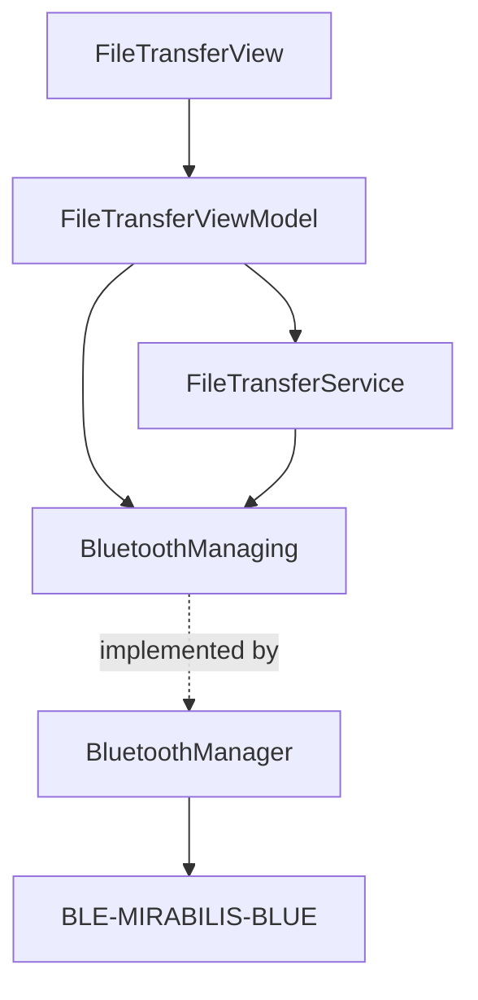
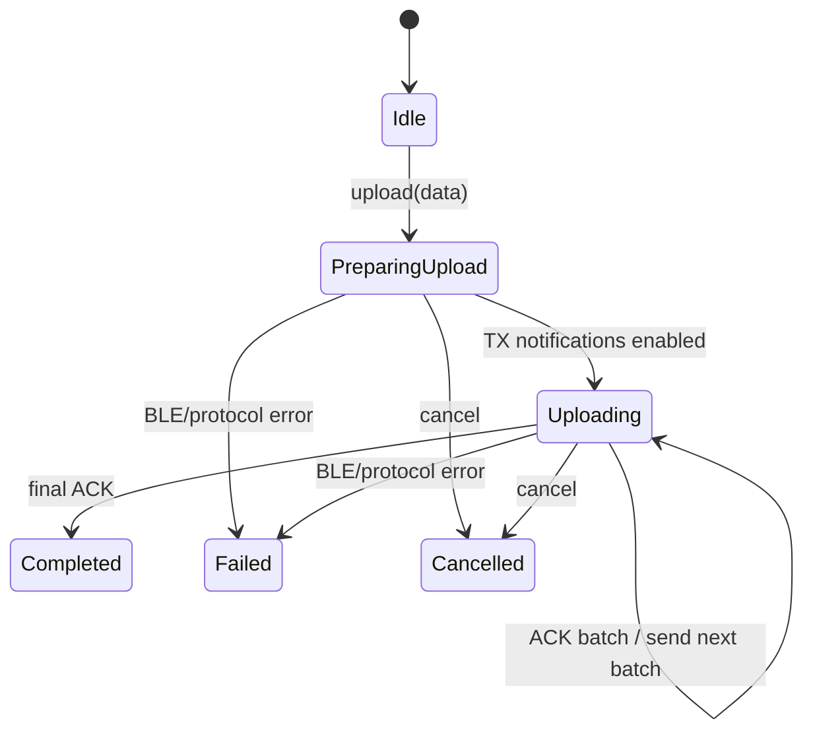
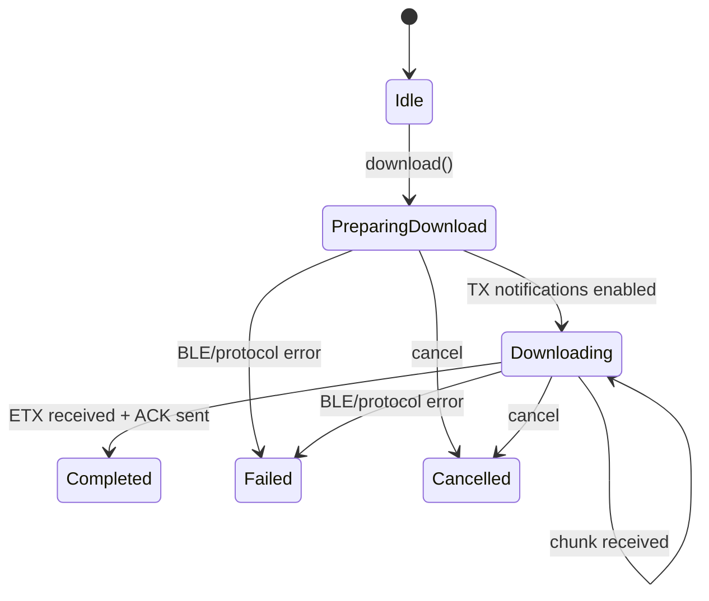
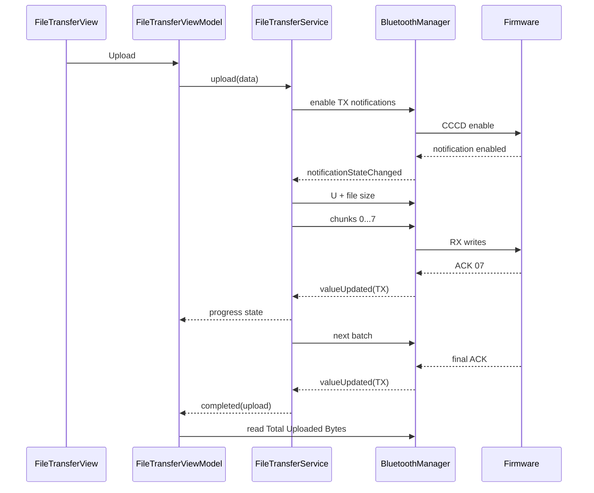
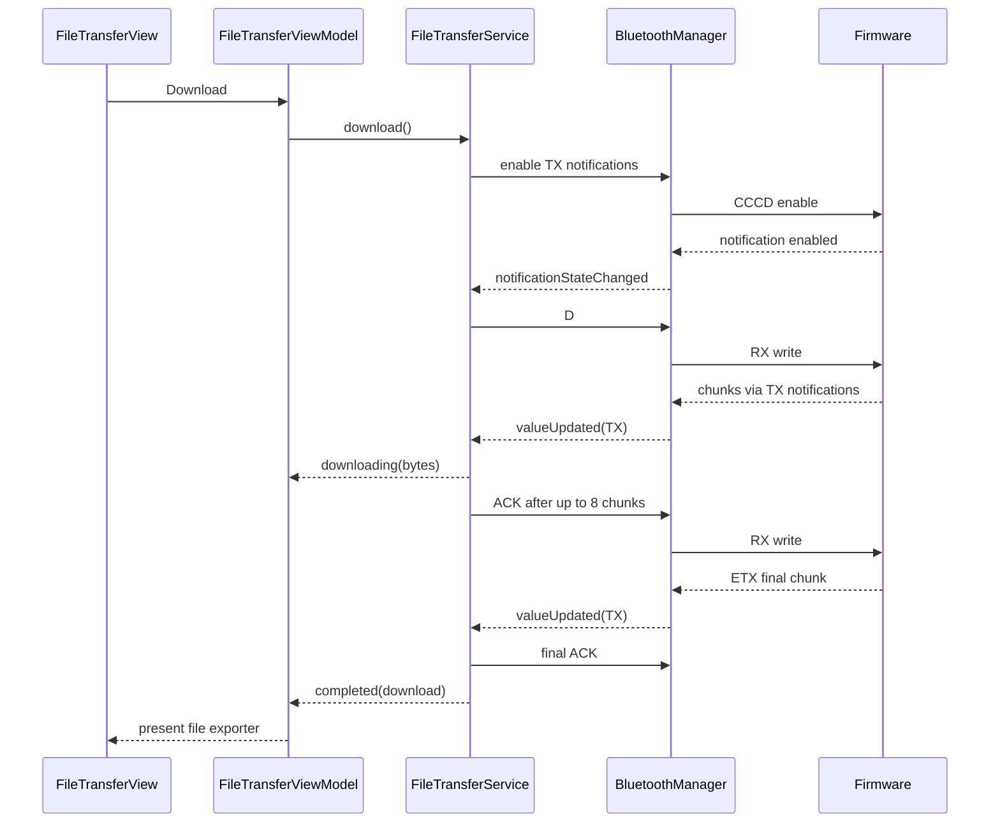

# Mirabilis Blue — File Transfer

> **Purpose:** Describe the file-transfer architecture, BLE transport mapping, packet format, upload/download state machines, reliability rules, and application implementation.
>
> The protocol described here targets BLE-MIRABILIS-BLUE firmware v0.6.2.

---

## 1. Architectural boundary

File transfer is intentionally **not implemented inside `BluetoothManager`**.



### `BluetoothManager`

Owns BLE transport only: characteristic reads/writes, notification subscriptions, CoreBluetooth callbacks, and generic BLE errors.

### `FileTransferService`

Owns protocol behavior: commands, chunking, sequence numbers, ACK/NACK/CAN, batching, download reconstruction, transfer state, and protocol errors.

### `FileTransferViewModel`

Owns feature presentation logic: selected file, validation, connection gating, progress/status text, cumulative upload statistics, and downloaded-data export.

---

## 2. GATT transport

| Name | UUID suffix | GATT operation | Direction |
|---|---:|---|---|
| File Transfer RX | `...000B` | Write Without Response | Central → Peripheral |
| File Transfer TX | `...000C` | Notify | Peripheral → Central |

The same pair is used for upload and download. The direction of chunks and acknowledgements changes with the operation.

Statistics use:

| Name | UUID suffix | Operation | Value |
|---|---:|---|---|
| Total Uploaded Bytes | `...000E` | Read | cumulative successful upload payload bytes since boot, `UInt64` little-endian |

---

## 3. Protocol constants

| Value | Name | Meaning |
|---:|---|---|
| `0x02` | STR | normal data chunk |
| `0x03` | ETX | final data chunk |
| `0x06` | ACK | acknowledgement |
| `0x15` | NACK | negative acknowledgement |
| `0x18` | CAN | cancel / abort |
| `0x55` (`U`) | UPLOAD | start upload |
| `0x44` (`D`) | DOWNLOAD | start download |

```text
Maximum file size      16,384 bytes
Maximum packet size        20 bytes
Chunk header                 2 bytes
Maximum payload             18 bytes
Chunks per ACK               8
Sequence number          UInt8
```

---

## 4. Chunk format

```text
+---------+----------+----------------------+
| Byte 0  | Byte 1   | Bytes 2 ... 19       |
+---------+----------+----------------------+
| Marker  | Sequence | Payload (0...18 B)   |
+---------+----------+----------------------+
```

`STR (0x02)` marks a normal chunk and `ETX (0x03)` marks the final chunk.

Sequence numbers are `UInt8` and wrap normally:

```text
... FD → FE → FF → 00 → 01 ...
```

Rollover is valid and must not be treated as corruption.

---

## 5. Upload command

Upload starts with:

```text
'U' + uint32LE(file_size)
```

Layout:

```text
Offset  Size  Field
0       1     0x55 ('U')
1       4     file size, UInt32 little-endian
```

---

## 6. Upload sequence

```text
iOS Central                          Peripheral
    |                                   |
    |-- U + uint32LE(size) ------------>| RX 000B
    |-- STR 00 + payload -------------->|
    |-- STR 01 + payload -------------->|
    |   ...                             |
    |-- STR 07 + payload -------------->|
    |<---------------------- ACK 07 ----| TX 000C
    |                                   |
    |-- next batch -------------------->|
    |<---------------------- ACK NN ----|
    |                                   |
    |-- ETX NN + final payload -------->|
    |<---------------------- ACK NN ----|
    |                                   |
    |          upload complete           |
```

The app subscribes to File Transfer TX before starting so asynchronous responses cannot be missed.

---

## 7. Upload state machine



Upload progress includes:

```text
bytesTransferred
totalBytes
```

`bytesTransferred` represents acknowledged payload bytes, not merely bytes queued for BLE transmission.

---

## 8. Upload batching

The sender transmits up to eight chunks before waiting for an ACK.

The service retains upload context equivalent to:

```text
chunks
totalBytes
nextChunkIndex
lastBatchStartIndex
lastBatchEndIndex
acknowledgedBytes
hasStartedTransmission
```

On ACK it:

1. validates the ACK sequence against the final chunk of the batch;
2. calculates acknowledged payload bytes;
3. updates progress;
4. completes if all chunks are acknowledged;
5. otherwise sends the next batch.

The final ETX chunk is always acknowledged.

---

## 9. Download command

Download begins with one byte:

```text
'D' = 0x44
```

The central must subscribe to File Transfer TX before sending it.

---

## 10. Download sequence

```text
iOS Central                          Peripheral
    |                                   |
    |-- D ----------------------------->| RX 000B
    |<----------- STR 00 + payload -----| TX 000C
    |<----------- STR 01 + payload -----|
    |              ...                  |
    |<----------- STR 07 + payload -----|
    |-- ACK 07 ------------------------>| RX 000B
    |                                   |
    |<----------- next batch -----------|
    |-- ACK NN ------------------------>|
    |                                   |
    |<----------- ETX NN + final -------|
    |-- ACK NN ------------------------>|
    |                                   |
    |         download complete          |
```

Downloaded payload bytes are concatenated in sequence order.

---

## 11. Download state machine



The protocol does not provide total download size before sending chunks, so download UI uses indeterminate progress plus a byte count rather than a percentage.

---

## 12. Download reconstruction

The service stores:

```text
data
expectedSequence
chunksSinceLastAcknowledgement
hasStartedTransmission
```

For every packet it validates:

1. marker + sequence exist;
2. marker is STR or ETX;
3. payload is at most 18 bytes;
4. sequence equals the expected sequence;
5. reconstructed data will not exceed 16 KiB.

It then appends payload, advances the sequence with wrapping arithmetic, updates progress, and sends ACK after eight chunks or immediately for ETX.

---

## 13. Completion

### Upload

Upload completes only after the final ACK has been validated:

```swift
.completed(
    .upload(bytesTransferred: totalBytes)
)
```

### Download

Download completes after the ETX packet is validated, appended, and acknowledged:

```swift
.completed(
    .download(bytesTransferred: downloadedBytes)
)
```

The reconstructed data is exposed as `downloadedData`. The ViewModel then presents the system file exporter.

The protocol does not carry a filename, so the app uses a default such as:

```text
mirabilis_download.bin
```

---

## 14. Cancellation

Cancellation uses:

```text
CAN = 0x18
```

The app writes CAN to File Transfer RX, clears local transfer contexts, and enters:

```text
cancelled
```

---

## 15. Disconnect behavior

A BLE disconnect aborts an in-progress transfer.

`FileTransferService` observes the disconnect and, when a transfer is active, transitions to:

```text
failed(.disconnected)
```

and clears upload/download contexts.

### Important consequence

Reconnection restores the BLE session but **does not resume the transfer**.

The current protocol has no resume offset or resumable-session metadata. The user starts the upload or download again.

---

## 16. Peripheral file lifecycle

BLE-MIRABILIS-BLUE v0.6.2 stores one file in a fixed RAM-backed slot.

| Event | Stored file | Total Uploaded Bytes |
|---|---|---|
| successful upload | new file retained in RAM | increases |
| later upload | previous file replaced | increases again |
| BLE disconnect | retained | retained |
| BLE reconnect | retained | retained |
| download | retained | unchanged |
| repeated download | retained | unchanged |
| firmware reset | lost | resets |
| power loss | lost | resets |

A disconnect aborts the active transfer, but it does not erase a previously completed upload.

---

## 17. Total Uploaded Bytes

Characteristic `...000E` contains a `UInt64` little-endian cumulative count of successful upload payload bytes since boot.

It is a statistic, not current-transfer progress.

After a successful upload, the ViewModel refreshes it when the connection is available.

---

## 18. Security

The relevant GATT attributes require an encrypted connection:

```text
000B File Transfer RX      encrypted Write Without Response
000C File Transfer TX      encrypted Notify / CCCD
000E Total Uploaded Bytes  encrypted Read
```

Pairing/security establishment belongs to the BLE/CoreBluetooth layer, not to the file-transfer protocol service.

---

## 19. Error model

`FileTransferError` separates protocol failures from transport failures.

Typical cases:

```text
fileTooLarge
emptyFile
payloadTooLarge
malformedPacket
unexpectedSequence
negativeAcknowledgement
timeout
disconnected
transferAlreadyInProgress
bluetooth(BluetoothError)
```

Layering direction:

```text
BluetoothError
    ↓ may be wrapped by
FileTransferError.bluetooth(...)
```

The reverse dependency must not exist.

---

## 20. NACK handling

A NACK indicates that the receiver rejected a batch or chunk.

The current implementation treats it as a transfer failure:

```text
negativeAcknowledgement(sequence?)
```

Automatic retransmission is not currently implemented. If added later, it belongs in `FileTransferService`, not `BluetoothManager`.

---

## 21. File-size validation

Maximum supported file size:

```text
16,384 bytes
```

Validation occurs in multiple layers:

- file selection rejects non-files, empty files, and files above 16 KiB;
- `FileTransferService.upload` validates again;
- download reconstruction refuses to exceed the firmware limit.

This is deliberate defense in depth.

---

## 22. Connection-aware UI

`FileTransferViewModel` gates operations using shared connection state.

Typical availability checks include:

```text
canChooseFile
canReadStatistics
canUpload
canDownload
canCancel
```

Actions also guard connectivity before invoking protocol work, while `BluetoothManager` performs its own transport-level connection and characteristic guards.

---

## 23. Upload event flow



---

## 24. Download event flow



---

## 25. Known design limitations / future improvements

Potential extensions include:

- transfer timeout;
- automatic retry after NACK;
- retry limits;
- explicit CAN after locally-detected malformed download packets;
- notification-subscription state caching;
- Write Without Response backpressure;
- checksum/digest validation;
- resumable transfer if future firmware adds offsets/session metadata;
- filename/metadata transfer if the protocol is extended.

These belong in `FileTransferService` or another protocol-specific layer, not in the generic BLE transport.

---

## 26. Related documentation

- [`ARCHITECTURE.md`](./ARCHITECTURE.md)
- [`BLUETOOTH_ARCHITECTURE.md`](./BLUETOOTH_ARCHITECTURE.md)
- BLE-MIRABILIS-BLUE Firmware Developer Guide v0.6.2
- BLE-MIRABILIS-BLUE GATT Reference v0.6.2
