# Mirabilis Blue — UI Navigation & Interaction Flow

> **Purpose:** Explain how the Mirabilis Blue iOS user interface is structured, how navigation is coordinated, and how UI components interact with ViewModels, the application coordinator, and Bluetooth services.
>
> This document focuses on **UI behavior and navigation flow**. For lower-level BLE details, see [`BLUETOOTH_ARCHITECTURE.md`](./BLUETOOTH_ARCHITECTURE.md). For the file-transfer protocol, see [`FILE_TRANSFER.md`](./FILE_TRANSFER.md).

---

## 1. UI architecture at a glance

The UI follows a **SwiftUI + MVVM + Coordinator** structure.

The main rule is:

> **Views render state and forward user actions.  
> ViewModels own feature behavior and presentation state.  
> The Coordinator owns navigation.**

The UI does not navigate by having feature ViewModels directly manipulate a `NavigationStack`.

Instead, feature-level events are surfaced to `AppCoordinator`, which updates the navigation path.

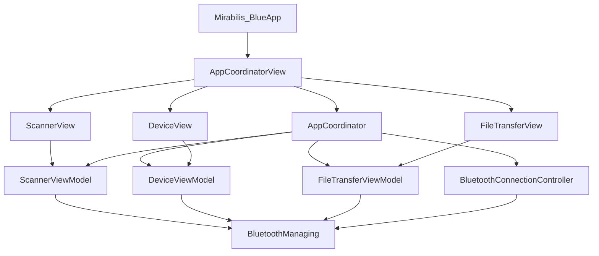

---

## 2. Root navigation container

`AppCoordinatorView` is the root UI container.

It owns the SwiftUI `NavigationStack` binding through the coordinator:

```swift
NavigationStack(
    path: $coordinator.path
)
```

The initial/root screen is:

```text
ScannerView
```

Navigation destinations are created from `AppCoordinator.Route`.

Conceptually:

```swift
enum Route: Hashable {
    case device(BluetoothDevice)
    case fileTransfer(BluetoothDevice)
}
```

The coordinator therefore acts as the application's navigation state machine.

---

## 3. Main navigation flow

The main user journey is:

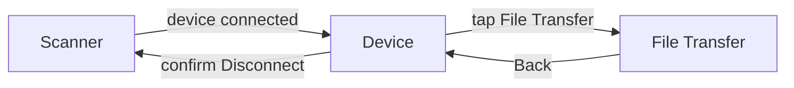

This gives the app a simple hierarchy:

```text
Scanner
   ↓
Device
   ↓
File Transfer
```

`File Transfer` is a child of the connected-device context rather than a completely independent app section.

---

## 4. Scanner screen

`ScannerView` is the application's starting screen.

The View itself is intentionally small. It:

- renders the Scan button;
- invokes `viewModel.scan()`;
- presents `ScannerSheet` based on ViewModel state;
- forwards Retry and Cancel actions back to the ViewModel.

The sheet is driven by:

```text
ScannerViewModel.State
```

which contains:

```text
idle
scanning
connecting(device)
noDeviceFound
```

The View does not decide when scanning has timed out or when a device has connected. Those decisions belong to `ScannerViewModel`.

---

## 5. Scanner UI state flow

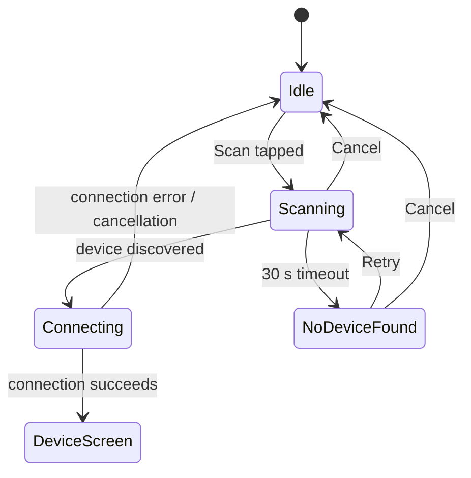

The corresponding visible UI is roughly:

```text
idle
    → Scanner screen only

scanning
    → Scanner sheet: "Scanning..."

connecting(device)
    → Scanner sheet: "Connecting..."

noDeviceFound
    → Scanner sheet: "No device has been found"
      [Retry] [Cancel]
```

---

## 6. Scan → Device navigation sequence

The Scanner does not directly push `DeviceView`.

Instead, navigation happens through a callback owned by the coordinator.

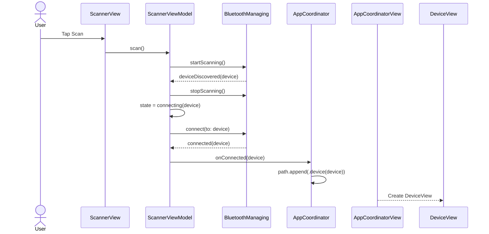

This is a key Coordinator responsibility:

> **The Scanner feature reports that connection succeeded.  
> The Coordinator decides that this means navigation to Device.**

---

## 7. Device screen

`DeviceView` represents the connected peripheral.

Its UI exposes BLE operations grouped by purpose, including:

```text
Device Information
Basic Operations
Notifications
Write Without Response
Secure Operations
File Transfer
Statistics
```

The View does not perform GATT operations directly.

User actions are forwarded to `DeviceViewModel`, which calls `BluetoothManaging`.

For example:

```text
Read button
    ↓
DeviceViewModel
    ↓
BluetoothManaging.read(...)
```

and:

```text
Notify toggle
    ↓
DeviceViewModel
    ↓
BluetoothManaging.setNotifications(...)
```

---

## 8. Device screen interaction sequence

A typical GATT read interaction looks like this:

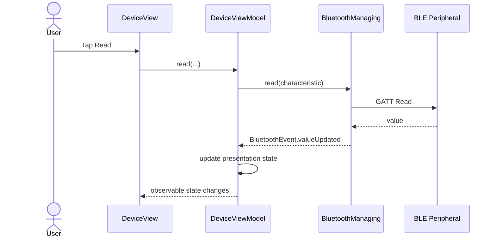

SwiftUI then re-renders from the updated ViewModel state.

---

## 9. Device → File Transfer navigation

The File Transfer row is not responsible for pushing a new screen itself.

`DeviceView` exposes an application-level callback:

```text
onFileTransferTapped
```

`AppCoordinatorView` wires that callback to:

```swift
coordinator.showFileTransfer(
    for: device
)
```

The coordinator appends:

```text
.fileTransfer(device)
```

to the navigation path.

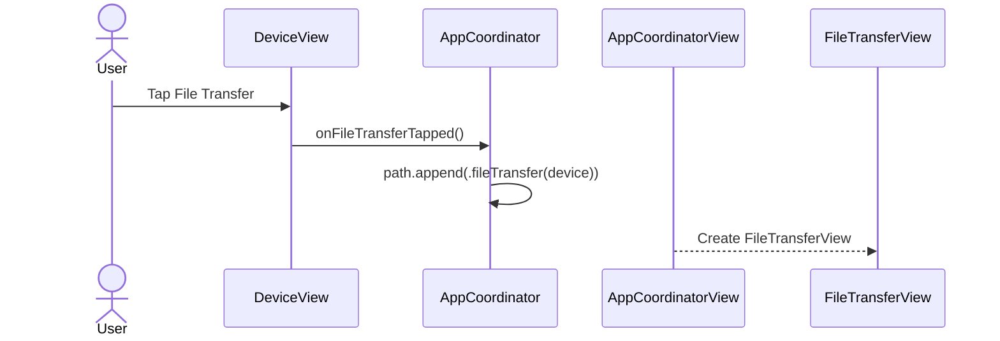

This keeps navigation knowledge out of `DeviceViewModel`.

---

## 10. File Transfer screen

`FileTransferView` is a feature screen inside the connected-device flow.

The UI contains two major sections:

```text
Statistics
Transfer
```

### Statistics

Displays:

```text
Total Uploaded Bytes
```

and allows the user to refresh the value.

### Transfer

Provides:

```text
Choose File
Upload
Download
Cancel Transfer
Progress / status
```

The available controls depend on both connection state and `FileTransferState`.

The ViewModel exposes UI-friendly values such as:

```text
canChooseFile
canReadStatistics
canUpload
canDownload
canCancel
uploadProgress
transferStatusText
```

This means the View does not need to reproduce protocol or connection-state logic.

---

## 11. File selection interaction

The file importer is presented by SwiftUI, but validation belongs to the ViewModel.

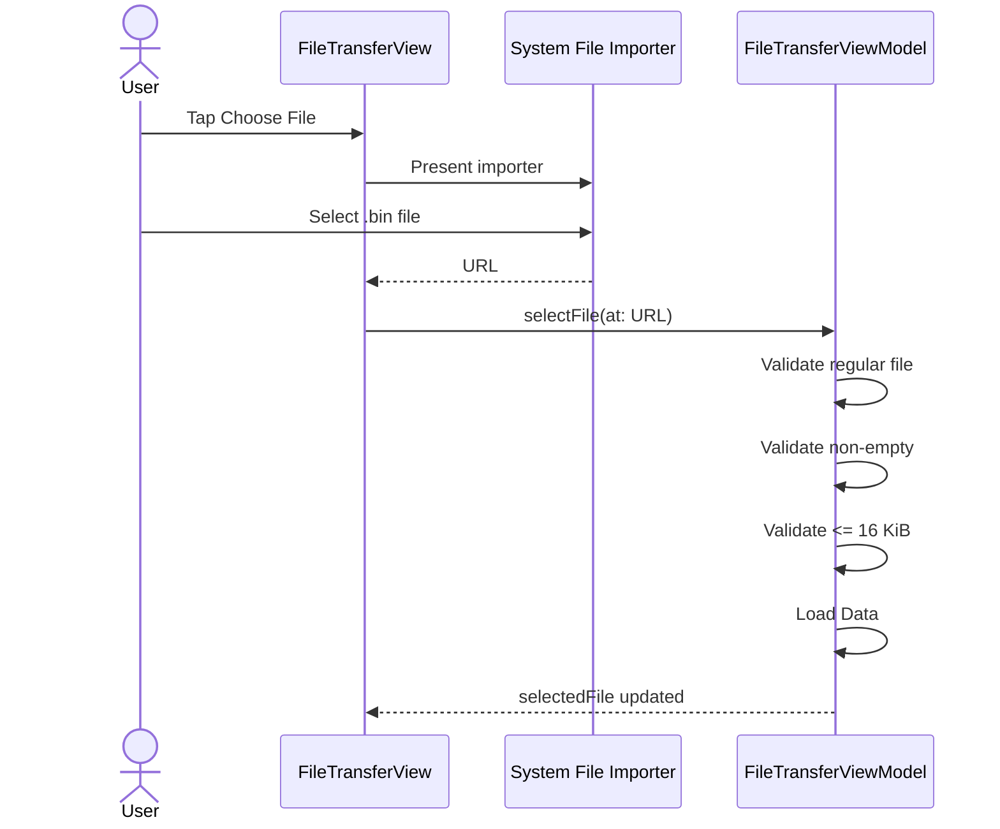

The UI then shows the selected filename and size.

---

## 12. Upload UI sequence

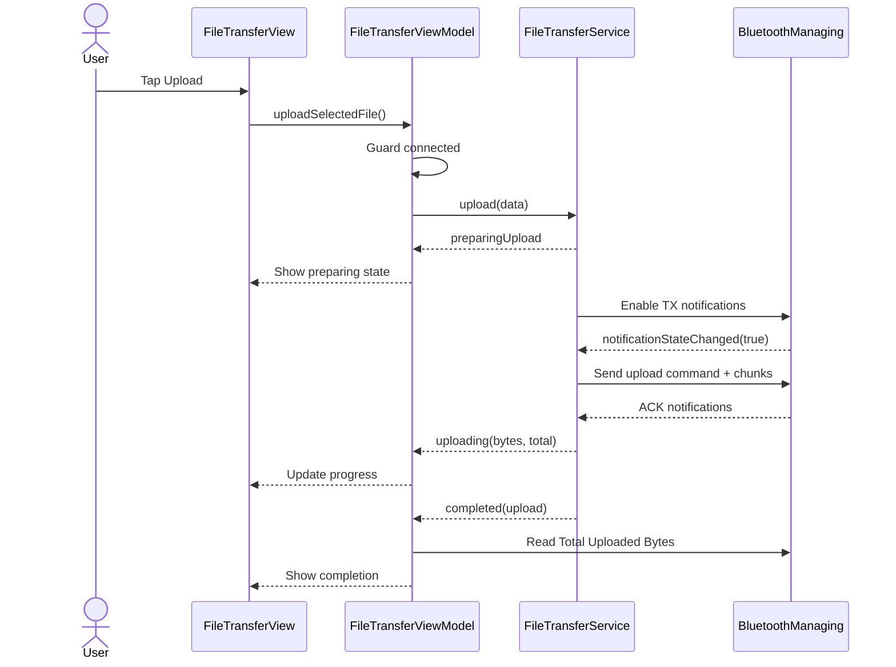

The View therefore presents protocol progress without knowing anything about STR, ETX, sequence numbers, or ACK batches.

---

## 13. Download UI sequence

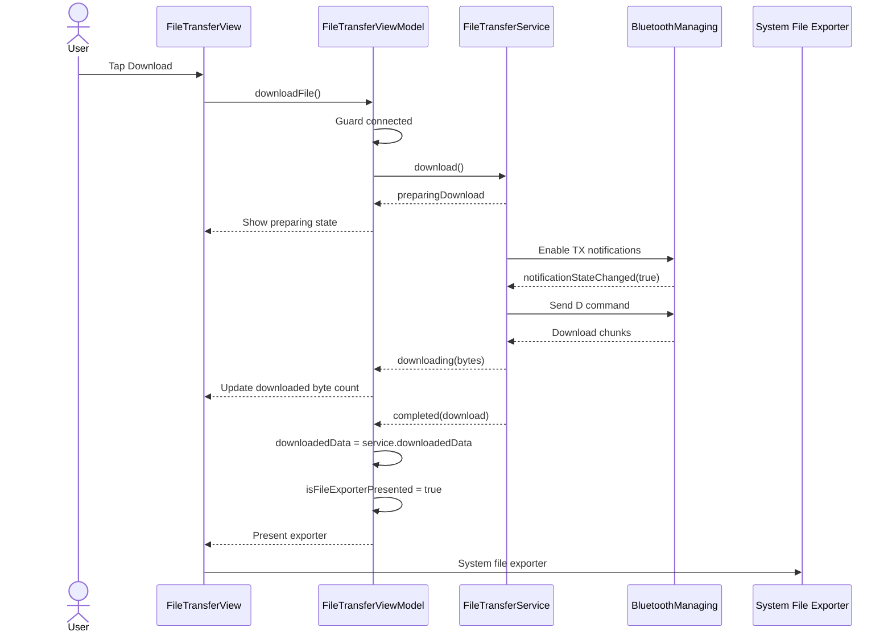

Download progress is intentionally indeterminate because the protocol does not provide the total file size before the transfer begins.

---

## 14. Back navigation

Normal backward navigation is handled by the `NavigationStack`.

From File Transfer:

```text
File Transfer
    ↓ Back
Device
```

This does not disconnect BLE.

The user remains inside the same connected-device context.

The Device screen behaves differently because leaving it may imply ending the connection.

---

## 15. Intentional disconnect from Device

The Device screen uses an explicit disconnect confirmation rather than silently tearing down BLE when the view disappears.

Conceptually:

```text
User taps Back / Disconnect
    ↓
Confirmation alert
    ↓
Yes
    ↓
Coordinator disconnects
    ↓
Coordinator clears navigation path
    ↓
Scanner
```

Sequence:

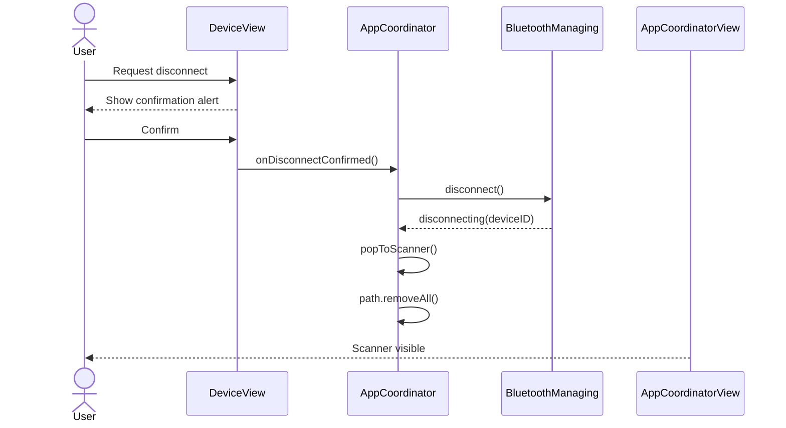

Navigation and connection teardown are coordinated at the application-flow boundary.

---

## 16. Why disconnect navigation belongs to the Coordinator

If `DeviceViewModel` disconnected BLE and independently controlled navigation, it would mix feature behavior with application navigation.

Instead:

```text
DeviceView
    ↓ user intent
AppCoordinator
    ├── BLE disconnect
    └── navigation reset
```

This keeps the route transition explicit and centralized.

---

## 17. Unexpected disconnect

Unexpected Bluetooth loss can occur while the user is on either:

```text
DeviceView
```

or:

```text
FileTransferView
```

Reconnect UI therefore cannot belong exclusively to either feature screen.

This is why the application uses:

```text
BluetoothConnectionController
```

as shared application-level presentation state.

---

## 18. Unexpected disconnect UI sequence

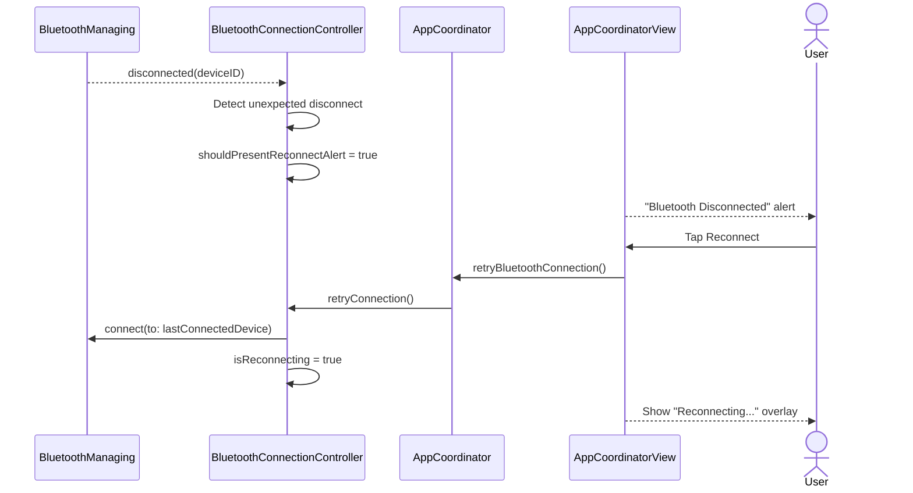

Because this UI is attached at the root level, it can appear regardless of the currently visible connected-device feature.

---

## 19. Initial connection vs reconnection

The application intentionally treats these as separate presentation flows.

### Initial connection

Owned by:

```text
ScannerView + ScannerViewModel
```

Visible presentation:

```text
ScannerSheet → "Connecting..."
```

### Reconnection

Owned by:

```text
BluetoothConnectionController + AppCoordinatorView
```

Visible presentation:

```text
Global "Reconnecting..." overlay
```

This separation avoids showing both indicators during an ordinary first connection.

---

## 20. Reconnect success

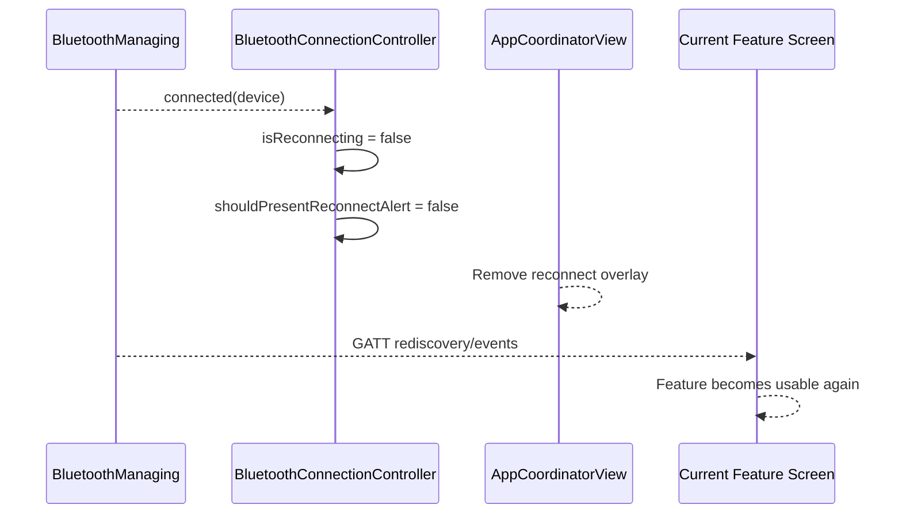

The current route remains intact.

For example, if the user was on File Transfer before losing the link, a successful reconnect does not automatically navigate away from that screen.

---

## 21. File Transfer during disconnect/reconnect

`FileTransferViewModel` is connection-aware.

When disconnected, BLE-dependent actions are unavailable:

```text
canChooseFile      = false
canReadStatistics  = false
canUpload          = false
canDownload        = false
canCancel          = false
```

The screen may remain visible, but BLE actions are disabled.

An active transfer is failed by `FileTransferService`.

The app does **not** automatically resume that transfer after reconnection.

After reconnecting, the File Transfer screen can become interactive again.

---

## 22. UI event boundaries

The architecture deliberately uses different mechanisms for different responsibilities.

### SwiftUI → ViewModel

Direct method calls:

```text
scan()
retry()
read(...)
write(...)
uploadSelectedFile()
downloadFile()
cancelTransfer()
```

### ViewModel → BLE

Protocol calls through:

```text
BluetoothManaging
```

### BLE → ViewModel

Observer events:

```text
BluetoothEvent
```

### ViewModel → View

Swift Observation:

```text
@Observable
@State
@Bindable
```

### Feature → Navigation

Coordinator callbacks:

```text
onConnected
onFileTransferTapped
onDisconnectConfirmed
```

### Global connection UX

Shared application presentation controller:

```text
BluetoothConnectionController
```

---

## 23. UI interaction architecture

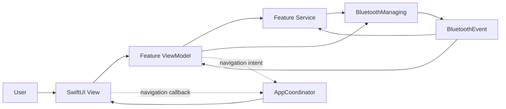

The dashed relationships represent application navigation rather than feature/business data flow.

---

## 24. Navigation ownership summary

| Responsibility | Owner |
|---|---|
| Root `NavigationStack` | `AppCoordinatorView` |
| Navigation path | `AppCoordinator` |
| Scan presentation state | `ScannerViewModel` |
| Scan sheet | `ScannerView` / `ScannerSheet` |
| Device feature state | `DeviceViewModel` |
| File Transfer feature state | `FileTransferViewModel` |
| File importer/exporter presentation | `FileTransferView` + `FileTransferViewModel` |
| Navigation to Device | `AppCoordinator` |
| Navigation to File Transfer | `AppCoordinator` |
| Return to Scanner after disconnect | `AppCoordinator` |
| Unexpected-disconnect alert | root UI via `BluetoothConnectionController` |
| Reconnect overlay | root UI via `BluetoothConnectionController` |

---

## 25. Why this UI structure works well

Each layer answers a different question:

```text
View
    "What should I render?"

ViewModel
    "What does this screen mean and what can the user do?"

Coordinator
    "Where should the application go?"

BluetoothConnectionController
    "What global connection UX should be visible?"

FileTransferService
    "What stage is the transfer protocol in?"

BluetoothManager
    "What is happening at the BLE transport level?"
```

That separation prevents a SwiftUI screen from becoming responsible for navigation, BLE calls, protocol parsing, connection recovery, and presentation state simultaneously.

---

## 26. Complete UI flow

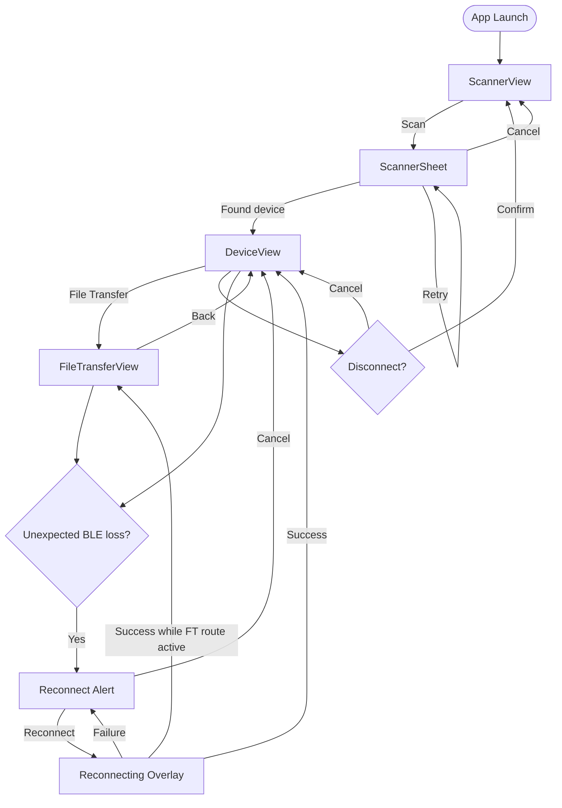

---

## 27. Related documentation

- [`ARCHITECTURE.md`](./ARCHITECTURE.md) — overall application architecture.
- [`BLUETOOTH_ARCHITECTURE.md`](./BLUETOOTH_ARCHITECTURE.md) — CoreBluetooth lifecycle, GATT, observers, reconnection.
- [`FILE_TRANSFER.md`](./FILE_TRANSFER.md) — upload/download protocol and state machines.
